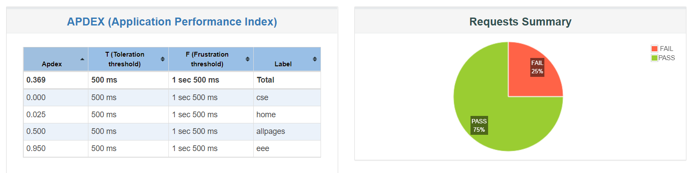
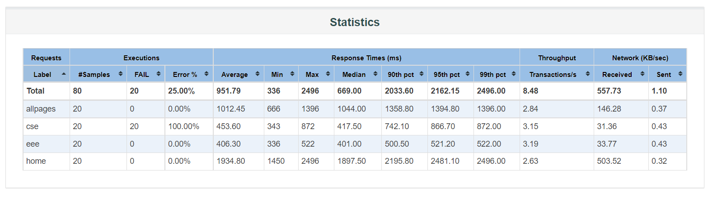
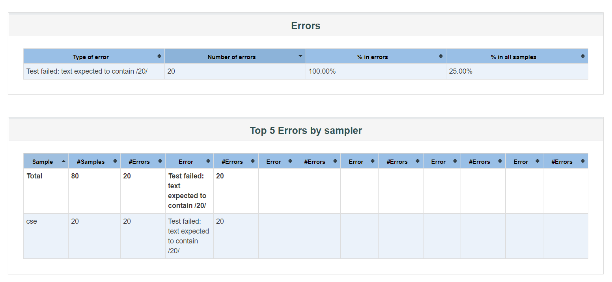

# JMeter-BSMRSTU-Web-Load-Testing-

    
<h3 align="center">I`m a passionate Web-Developer from Bangladesh</h3>   

    
<h3 align="center">I`m a passionate Web-Developer from Bangladesh</h3>   

    
<h3 align="center">I`m a passionate Web-Developer from Bangladesh</h3>   

    
<h3 align="center">I`m a passionate Web-Developer from Bangladesh</h3>   

